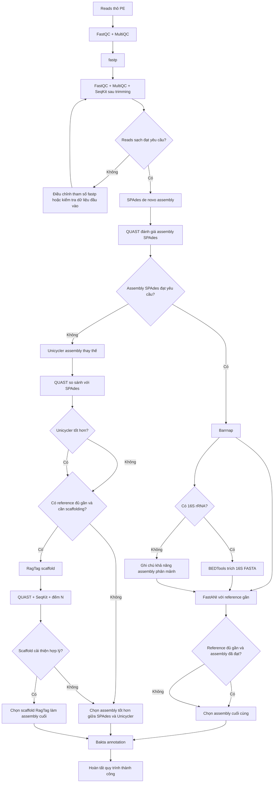

# README quy trình WGS Bacillus

## Tóm tắt điều hành

Workflow cung cấp một pipeline WGS cho Vi khuẩn từ dữ liệu Illumina paired-end, đi qua các bước: QC dữ liệu thô, làm sạch reads, QC sau trimming, lắp ráp de novo bằng SPAdes, đánh giá bằng QUAST, tìm 16S rRNA bằng Barrnap rồi trích FASTA bằng BEDTools, so sánh ANI bằng FastANI, thử assembly thay thế bằng Unicycler, scaffolding theo reference bằng RagTag, và cuối cùng chuẩn bị annotation bằng Bakta. 

## Mục đích, đầu vào chuẩn hóa và logic quyết định

README này giả định dữ liệu đầu vào là **Illumina paired-end reads của một isolate Bacillus**, kèm theo một **reference genome gần** nếu bạn muốn chạy FastANI và có khả năng dùng RagTag. Các đường dẫn được chuẩn hóa để tránh gắn chặt với máy tính hay cấu trúc thư mục cá nhân. Cách chuẩn hóa này cũng phù hợp với thông lệ viết README tái sử dụng trong Git. citeturn12search0turn12search2turn18search0

### Biến và placeholder chuẩn hóa

| Placeholder | Ý nghĩa |
|---|---|
| `<PROJECT_DIR>` | Thư mục gốc của dự án |
| `<SAMPLE>` | Mã mẫu |
| `<RAW_R1>` | `${PROJECT_DIR}/data/raw/${SAMPLE}_R1.fastq.gz` |
| `<RAW_R2>` | `${PROJECT_DIR}/data/raw/${SAMPLE}_R2.fastq.gz` |
| `<REF_FASTA>` | `${PROJECT_DIR}/data/ref/<REFERENCE>.fasta` |
| `<BAKTA_DB>` | Đường dẫn database Bakta |
| `<THREADS>` | Số luồng chung |
| `<TRIM_THREADS>` | Số luồng cho fastp |
| `<ASM_THREADS>` | Số luồng cho SPAdes / QUAST / Unicycler / RagTag |
| `<RAM_GB>` | RAM tối đa cho SPAdes |

### Khẳng định lại bước cuối và các bước có điều kiện

Trong README nên ghi rõ theo cách sau.

**Bước cuối trong trường hợp chạy thành công:**  
`Bakta` trên **assembly cuối cùng đã được chọn**. Nếu SPAdes cho assembly tốt nhất, Bakta chạy trên assembly SPAdes. Nếu Unicycler hoặc RagTag cho assembly phù hợp hơn và được chấp nhận sau đánh giá, Bakta chạy trên assembly đó. Đây là bước “đóng pipeline” vì nó chuyển assembly đã chốt thành bộ annotation chuẩn hóa, có thể dùng cho downstream analysis hoặc nộp cơ sở dữ liệu. citeturn11search0turn16search5turn16search6

**Các bước luôn chạy trong đường chính:**  
FastQC/MultiQC trên reads thô, fastp, FastQC/MultiQC/SeqKit sau trimming, SPAdes, QUAST trên assembly SPAdes. Đây là trục xương sống của workflow. citeturn0search0turn17search2turn9search0turn15search1turn18search0turn11search1

**Các bước phân tích bổ sung nhưng không phải bước cứu assembly:**  
Barrnap, BEDTools trích 16S, FastANI. Chúng cung cấp thông tin rRNA/16S và mức tương đồng toàn genome, nhưng không tự sửa assembly. BEDTools chỉ chạy nếu Barrnap tìm được feature 16S trong GFF. FastANI hữu ích để hỗ trợ định danh gần loài và đánh giá độ gần của reference, đặc biệt vì mức khoảng **95% ANI** thường được dùng như ranh giới loài ở prokaryote. citeturn13view0turn17search3turn16search2turn17search4

**Các bước chỉ chạy khi cần hoặc khi đường chính chưa đạt:**  
Unicycler và RagTag. Unicycler nên chạy nếu assembly SPAdes còn quá phân mảnh hoặc bạn muốn có một assembly thay thế để so sánh. RagTag chỉ nên chạy nếu có reference đủ gần và mục tiêu là sắp xếp/orient contigs hoặc cải thiện tính liên tục theo hướng reference-guided; nó không thay thế cho lắp ráp de novo. citeturn3search0turn2search1turn7view0turn5search1turn16search2

### Cách diễn đạt ngắn gọn nên đặt đầu README

```text
Quy trình chuẩn kết thúc ở bước Bakta annotation của assembly cuối cùng đã được chọn.
Unicycler và RagTag là các bước có điều kiện:
- Unicycler: chạy khi assembly SPAdes chưa đạt yêu cầu hoặc cần assembly thay thế để so sánh.
- RagTag: chỉ chạy khi có reference đủ gần và cần reference-guided scaffolding.
- BEDTools trích 16S: chỉ chạy khi Barrnap phát hiện được feature 16S rRNA.
```

Những câu này phản ánh đúng bản chất của từng công cụ theo tài liệu chính thức và phù hợp với workflow bạn đã gửi. citeturn13view0turn3search0turn7view0turn11search0

## Tóm tắt quy trình và lưu đồ quyết định

### Tóm tắt quy trình bằng lời

Luồng vận hành hợp lý nhất của README là: kiểm tra reads thô → làm sạch reads → kiểm tra lại reads sạch → lắp ráp de novo bằng SPAdes → đánh giá bằng QUAST. Nếu assembly SPAdes đạt yêu cầu, bạn tiếp tục các phân tích bổ sung như Barrnap/BEDTools và FastANI, sau đó **chốt assembly cuối cùng** và chạy Bakta. Nếu assembly SPAdes chưa đạt yêu cầu, bạn mới chạy **Unicycler** để có assembly thay thế; nếu vẫn cần sắp thứ tự/orient contigs theo reference gần, khi đó mới cân nhắc **RagTag**. Sau khi so sánh các ứng viên assembly, bạn chọn một assembly cuối cùng duy nhất và chuyển nó sang Bakta. citeturn18search0turn11search1turn3search0turn7view0turn11search0

### Lưu đồ quyết định bằng Mermaid



Lưu đồ trên tổng hợp workflow gốc bạn cung cấp với logic vận hành phù hợp hơn cho README: Bakta là điểm kết thúc của nhánh thành công, còn Unicycler và RagTag là nhánh điều kiện. Phần “đạt yêu cầu / chưa đạt yêu cầu” không phải ngưỡng cứng của tác giả phần mềm, mà là tiêu chí vận hành được suy ra từ loại output và metric mà FastQC, fastp, QUAST, FastANI và RagTag cung cấp. fileciteturn0file0 citeturn0search0turn17search2turn9search0turn11search1turn16search2turn7view0

### Bảng tóm tắt workflow bằng tiếng Việt

| Bước | Công cụ | Bắt buộc / Có điều kiện | Input đại diện | Output đại diện | Mục đích | Tiêu chí đi tiếp / quyết định |
|---:|---|---|---|---|---|---|
| 1 | FastQC | Bắt buộc | `data/raw/<SAMPLE>_R1.fastq.gz`, `data/raw/<SAMPLE>_R2.fastq.gz` | `results/qc/raw/*_fastqc.html`, `*_fastqc.zip` | Kiểm tra chất lượng reads thô | Nếu có vấn đề QC rõ rệt, vẫn đi tiếp sang fastp để xử lý |
| 2 | MultiQC | Bắt buộc | `results/qc/raw/` | `results/qc/raw_multiqc/multiqc_report.html` | Tổng hợp QC của FastQC | Dùng để nhìn nhanh toàn cục trước trimming |
| 3 | fastp | Bắt buộc | `<RAW_R1>`, `<RAW_R2>` | `results/trimmed/<SAMPLE>/*clean.fastq.gz`, HTML, JSON | Cắt adapter, cắt đuôi chất lượng thấp, lọc reads kém | Nếu tỉ lệ giữ reads và chất lượng sau lọc chấp nhận được thì đi tiếp |
| 4 | FastQC + MultiQC + SeqKit | Bắt buộc | clean FASTQ | báo cáo QC sau trimming + thống kê reads | Xác nhận preprocessing có cải thiện dữ liệu | Nếu chất lượng không cải thiện hoặc reads bị mất quá nhiều, xem lại fastp |
| 5 | SPAdes | Bắt buộc | clean FASTQ | `results/assembly/spades/<SAMPLE>/contigs.fasta` | Lắp ráp de novo chính | Tiếp QUAST để ra quyết định |
| 6 | QUAST trên SPAdes | Bắt buộc | `contigs.fasta` | `results/assembly/quast/<SAMPLE>/report.txt/html` | Đánh giá contiguity/chất lượng assembly | Nếu assembly hợp lý thì giữ đường chính; nếu quá phân mảnh thì thử Unicycler |
| 7 | Barrnap | Bổ sung | `contigs.fasta` | `results/rrna/<SAMPLE>/<SAMPLE>_rrna.gff` | Tìm rRNA, đặc biệt 16S | Nếu có 16S thì trích FASTA; nếu không có thì ghi chú khả năng assembly phân mảnh |
| 8 | BEDTools getfasta | Có điều kiện | `contigs.fasta` + `16S.gff` | `results/rrna/<SAMPLE>/<SAMPLE>_16S.fasta` | Trích trình tự 16S | Chỉ chạy khi Barrnap tìm thấy 16S |
| 9 | FastANI | Bổ sung | `contigs.fasta` + `<REF_FASTA>` | `results/ani/<SAMPLE>/<SAMPLE>_vs_reference.ani.txt` | Hỗ trợ định danh gần loài và đánh giá độ gần của reference | Nếu ANI/reference không phù hợp thì không nên dựa vào reference đó để scaffold |
| 10 | Unicycler | Có điều kiện | clean FASTQ | `results/assembly/unicycler/<SAMPLE>/assembly.fasta` | Assembly thay thế để so sánh / cứu hộ | Chỉ chạy khi SPAdes chưa tốt hoặc cần đối chứng |
| 11 | RagTag | Có điều kiện | `<REF_FASTA>` + assembly được chọn | `results/assembly/ragtag/<SAMPLE>/ragtag.scaffold.fasta` | Reference-guided scaffolding | Chỉ dùng khi reference đủ gần và scaffold thực sự cải thiện mà không tạo nghi ngờ lớn |
| 12 | QUAST + SeqKit sau RagTag | Có điều kiện | `ragtag.scaffold.fasta` | `report.txt/html`, thống kê GC/length, số `N` | Kiểm tra scaffold sau reference-guided step | Nếu cải thiện hợp lý thì có thể chọn làm assembly cuối |
| 13 | Bakta | Bước cuối | assembly cuối cùng đã chọn | `gff3`, `gbff`, `embl`, `faa`, `ffn`, `fna`, `json`, `txt`, `png`, `svg` | Annotation genome vi khuẩn | Đây là bước kết thúc của một lần chạy thành công |

Các cột “công cụ/đầu vào/đầu ra” bám theo workflow gốc bạn cung cấp và tài liệu chính thức của từng phần mềm; cột “tiêu chí đi tiếp” là khuyến nghị vận hành suy ra từ các loại báo cáo và metric mà các công cụ xuất ra, không phải ngưỡng cứng bắt buộc của nhà phát triển. fileciteturn0file0 citeturn14search9turn17search2turn9search0turn15search1turn18search0turn18search8turn13view0turn17search3turn17search4turn16search2turn16search0turn7view0turn16search5

## Thiết lập môi trường và các khối lệnh chuẩn hóa

### Cài đặt Conda channels và Mamba

Bioconda khuyến nghị cấu hình `bioconda` cùng `conda-forge` với `strict channel priority`; tài liệu Bioconda cũng khuyến nghị dùng `mamba` như một drop-in replacement để giải phụ thuộc nhanh hơn. Vì workflow này gồm nhiều gói bioinformatics, đây là cách cài đặt phù hợp nhất cho README. citeturn12search0turn12search2turn12search3

```bash
conda config --add channels bioconda
conda config --add channels conda-forge
conda config --set channel_priority strict

conda install -n base -c conda-forge mamba -y
```

### Môi trường chính cho QC, assembly và so sánh genome

Workflow gốc không pin version; theo yêu cầu của bạn, nếu chưa chỉ định thì nên ghi là **không có ràng buộc phiên bản cụ thể**. Để README gọn mà vẫn tái lập được, nên để YAML không pin version, sau đó chỉ pin khi dự án thực tế cần reproducibility chặt hơn. Hầu hết các công cụ trong workflow đều có bản phân phối qua Bioconda hoặc hướng dẫn cài đặt chính thức tương đương. citeturn12search0turn8search8turn8search6turn15search0turn4search1

```yaml
name: wgs_bacillus
channels:
  - conda-forge
  - bioconda
dependencies:
  - fastqc
  - multiqc
  - fastp
  - seqkit
  - spades
  - quast
  - barrnap
  - bedtools
  - fastani
  - unicycler
  - ragtag
```

```bash
mamba env create -f envs/wgs_bacillus.yml
conda activate wgs_bacillus
```

### Môi trường riêng cho Bakta

Bakta có thể cài bằng Bioconda, nhưng yêu cầu thêm một database bắt buộc; tài liệu Bakta khuyến nghị dùng `bakta_db download --output <path> --type [light|full]`, và `full` là lựa chọn khuyến nghị nếu muốn annotation đầy đủ nhất. citeturn4search1turn18search3turn18search2

```yaml
name: bakta_env
channels:
  - conda-forge
  - bioconda
dependencies:
  - bakta
```

```bash
mamba env create -f envs/bakta.yml
conda activate bakta_env

bakta_db download --output <BAKTA_DB_PARENT> --type full
```

### Khai báo biến chung

```bash
export PROJECT_DIR="/path/to/project"
export SAMPLE="<SAMPLE_ID>"

export THREADS=16
export TRIM_THREADS=8
export ASM_THREADS=8
export RAM_GB=16

export RAW_R1="${PROJECT_DIR}/data/raw/${SAMPLE}_R1.fastq.gz"
export RAW_R2="${PROJECT_DIR}/data/raw/${SAMPLE}_R2.fastq.gz"

export REF_FASTA="${PROJECT_DIR}/data/ref/<REFERENCE>.fasta"
export BAKTA_DB="/path/to/bakta_db"

mkdir -p \
  "${PROJECT_DIR}/results/qc/raw" \
  "${PROJECT_DIR}/results/qc/raw_multiqc" \
  "${PROJECT_DIR}/results/qc/trimmed" \
  "${PROJECT_DIR}/results/qc/trimmed_multiqc" \
  "${PROJECT_DIR}/results/trimmed/${SAMPLE}" \
  "${PROJECT_DIR}/results/assembly/spades/${SAMPLE}" \
  "${PROJECT_DIR}/results/assembly/quast/${SAMPLE}" \
  "${PROJECT_DIR}/results/assembly/unicycler/${SAMPLE}" \
  "${PROJECT_DIR}/results/assembly/ragtag/${SAMPLE}" \
  "${PROJECT_DIR}/results/rrna/${SAMPLE}" \
  "${PROJECT_DIR}/results/ani/${SAMPLE}" \
  "${PROJECT_DIR}/results/annotation/bakta/${SAMPLE}"
```

### Các khối lệnh chuẩn hóa theo từng bước

#### QC dữ liệu thô

```bash
fastqc \
  "${RAW_R1}" "${RAW_R2}" \
  -o "${PROJECT_DIR}/results/qc/raw" \
  -t "${THREADS}"

multiqc \
  "${PROJECT_DIR}/results/qc/raw" \
  -o "${PROJECT_DIR}/results/qc/raw_multiqc"
```

#### fastp

```bash
fastp \
  -i "${RAW_R1}" \
  -I "${RAW_R2}" \
  -o "${PROJECT_DIR}/results/trimmed/${SAMPLE}/${SAMPLE}_R1.clean.fastq.gz" \
  -O "${PROJECT_DIR}/results/trimmed/${SAMPLE}/${SAMPLE}_R2.clean.fastq.gz" \
  --detect_adapter_for_pe \
  --cut_right \
  --cut_right_window_size 4 \
  --cut_right_mean_quality 20 \
  --qualified_quality_phred 20 \
  --unqualified_percent_limit 20 \
  --length_required 50 \
  --correction \
  --thread "${TRIM_THREADS}" \
  --html "${PROJECT_DIR}/results/trimmed/${SAMPLE}/${SAMPLE}_fastp.html" \
  --json "${PROJECT_DIR}/results/trimmed/${SAMPLE}/${SAMPLE}_fastp.json"
```

#### QC sau trimming

```bash
fastqc \
  "${PROJECT_DIR}/results/trimmed/${SAMPLE}/${SAMPLE}_R1.clean.fastq.gz" \
  "${PROJECT_DIR}/results/trimmed/${SAMPLE}/${SAMPLE}_R2.clean.fastq.gz" \
  -o "${PROJECT_DIR}/results/qc/trimmed" \
  -t "${THREADS}"

multiqc \
  "${PROJECT_DIR}/results/qc/trimmed" \
  -o "${PROJECT_DIR}/results/qc/trimmed_multiqc"

seqkit stats \
  "${PROJECT_DIR}/results/trimmed/${SAMPLE}/${SAMPLE}_R1.clean.fastq.gz" \
  "${PROJECT_DIR}/results/trimmed/${SAMPLE}/${SAMPLE}_R2.clean.fastq.gz"
```

#### Assembly chính bằng SPAdes

```bash
spades.py \
  --isolate \
  -1 "${PROJECT_DIR}/results/trimmed/${SAMPLE}/${SAMPLE}_R1.clean.fastq.gz" \
  -2 "${PROJECT_DIR}/results/trimmed/${SAMPLE}/${SAMPLE}_R2.clean.fastq.gz" \
  -o "${PROJECT_DIR}/results/assembly/spades/${SAMPLE}" \
  -t "${ASM_THREADS}" \
  -m "${RAM_GB}"
```

#### QUAST cho assembly SPAdes

```bash
quast.py \
  "${PROJECT_DIR}/results/assembly/spades/${SAMPLE}/contigs.fasta" \
  -o "${PROJECT_DIR}/results/assembly/quast/${SAMPLE}" \
  -t "${ASM_THREADS}"
```

#### Barrnap và trích 16S nếu có

```bash
barrnap \
  --kingdom bac \
  "${PROJECT_DIR}/results/assembly/spades/${SAMPLE}/contigs.fasta" \
  > "${PROJECT_DIR}/results/rrna/${SAMPLE}/${SAMPLE}_rrna.gff"

grep "16S_rRNA" \
  "${PROJECT_DIR}/results/rrna/${SAMPLE}/${SAMPLE}_rrna.gff" \
  > "${PROJECT_DIR}/results/rrna/${SAMPLE}/${SAMPLE}_16S.gff" || true
```

```bash
if [[ -s "${PROJECT_DIR}/results/rrna/${SAMPLE}/${SAMPLE}_16S.gff" ]]; then
  bedtools getfasta \
    -fi "${PROJECT_DIR}/results/assembly/spades/${SAMPLE}/contigs.fasta" \
    -bed "${PROJECT_DIR}/results/rrna/${SAMPLE}/${SAMPLE}_16S.gff" \
    -s \
    -name \
    > "${PROJECT_DIR}/results/rrna/${SAMPLE}/${SAMPLE}_16S.fasta"

  seqkit stats "${PROJECT_DIR}/results/rrna/${SAMPLE}/${SAMPLE}_16S.fasta"
fi
```

#### FastANI

```bash
fastANI \
  -q "${PROJECT_DIR}/results/assembly/spades/${SAMPLE}/contigs.fasta" \
  -r "${REF_FASTA}" \
  -o "${PROJECT_DIR}/results/ani/${SAMPLE}/${SAMPLE}_vs_reference.ani.txt"
```

#### Nhánh có điều kiện: Unicycler

```bash
unicycler \
  -1 "${PROJECT_DIR}/results/trimmed/${SAMPLE}/${SAMPLE}_R1.clean.fastq.gz" \
  -2 "${PROJECT_DIR}/results/trimmed/${SAMPLE}/${SAMPLE}_R2.clean.fastq.gz" \
  -o "${PROJECT_DIR}/results/assembly/unicycler/${SAMPLE}" \
  -t "${ASM_THREADS}"
```

#### Nhánh có điều kiện: RagTag

```bash
ragtag.py scaffold \
  "${REF_FASTA}" \
  "${PROJECT_DIR}/results/assembly/spades/${SAMPLE}/contigs.fasta" \
  -o "${PROJECT_DIR}/results/assembly/ragtag/${SAMPLE}" \
  -t "${ASM_THREADS}"
```

```bash
quast.py \
  "${PROJECT_DIR}/results/assembly/ragtag/${SAMPLE}/ragtag.scaffold.fasta" \
  -r "${REF_FASTA}" \
  -o "${PROJECT_DIR}/results/assembly/ragtag/${SAMPLE}/quast" \
  -t "${ASM_THREADS}"

seqkit fx2tab -n -l -g \
  "${PROJECT_DIR}/results/assembly/ragtag/${SAMPLE}/ragtag.scaffold.fasta"

grep -o "N" \
  "${PROJECT_DIR}/results/assembly/ragtag/${SAMPLE}/ragtag.scaffold.fasta" \
  | wc -l
```

#### Bước cuối: Bakta trên assembly cuối cùng đã được chọn

Trong README nên khai báo rõ biến `FINAL_ASSEMBLY` rồi mới chạy Bakta. Đây là điểm giúp người đọc thấy Bakta là **kết thúc** chứ không phải chỉ là “chuẩn bị môi trường”. citeturn11search0turn16search5

```bash
# Ví dụ:
# export FINAL_ASSEMBLY="${PROJECT_DIR}/results/assembly/spades/${SAMPLE}/contigs.fasta"
# hoặc:
# export FINAL_ASSEMBLY="${PROJECT_DIR}/results/assembly/unicycler/${SAMPLE}/assembly.fasta"
# hoặc:
# export FINAL_ASSEMBLY="${PROJECT_DIR}/results/assembly/ragtag/${SAMPLE}/ragtag.scaffold.fasta"

conda activate bakta_env

bakta \
  --db "${BAKTA_DB}" \
  --threads "${ASM_THREADS}" \
  --output "${PROJECT_DIR}/results/annotation/bakta/${SAMPLE}" \
  "${FINAL_ASSEMBLY}"
```

Các khối lệnh trên sử dụng trực tiếp những option chính thức của từng công cụ: FastQC/MultiQC cho QC và report aggregation, fastp cho trimming/filtering/correction, SPAdes `--isolate` cho isolate coverage cao, QUAST cho đánh giá assembly, Barrnap `--kingdom bac` cho database bacteria, BEDTools `getfasta -s -name` để lấy đúng orientation và header, FastANI với `-q/-r/-o`, Unicycler cho assembly thay thế, RagTag `scaffold` cho reference-guided scaffolding, và Bakta với database bắt buộc. citeturn0search0turn17search2turn2search0turn18search0turn18search8turn13view0turn17search3turn12search4turn3search0turn7view0turn4search1

## Giải thích chi tiết từng công cụ

### FastQC

FastQC là công cụ QC cho dữ liệu giải trình tự hiệu năng cao; nó đọc FASTQ/SAM/BAM và sinh các module kiểm tra như per-base quality, per-sequence quality, GC content, duplication, adapter content và overrepresented sequences. Trong workflow này, FastQC là **bước quan sát**, không phải bước sửa dữ liệu; nó được chạy trước và sau fastp để so sánh chất lượng dữ liệu. FastQC có thể chạy non-interactive trong pipeline và ghi ra một file HTML cùng một file ZIP cho mỗi input. citeturn0search0turn0search4turn14search9

**Tham số dùng trong script:** `-o` để chọn thư mục output, `-t` để dùng nhiều luồng.  
**Lệnh ví dụ:**
```bash
fastqc "${RAW_R1}" "${RAW_R2}" -o "${PROJECT_DIR}/results/qc/raw" -t "${THREADS}"
```
**Mẹo xử lý lỗi thường gặp:** nếu HTML báo adapter hoặc quality drop mạnh ở cuối reads, đó là tín hiệu để chuyển qua fastp; nếu file đầu vào nén gzip thì FastQC vẫn hỗ trợ trực tiếp; nếu có nhiều mẫu, hãy đọc FastQC qua MultiQC thay vì mở từng report riêng lẻ. citeturn0search5turn14search9turn17search2

### MultiQC

MultiQC không thay thế FastQC; nó **quét thư mục kết quả** của nhiều công cụ và gộp chúng vào một report duy nhất. Với workflow này, MultiQC được dùng hai lần: sau FastQC trên reads thô và sau FastQC trên clean reads. Output mặc định là `multiqc_report.html` và thư mục `multiqc_data/`. Điều này rất phù hợp cho README vì người dùng mới thường dễ bỏ sót xu hướng chung nếu chỉ nhìn từng file FastQC riêng lẻ. citeturn8search1turn17search2turn17search1

**Tham số dùng trong script:** thư mục input và `-o` để đưa kết quả vào thư mục QC tương ứng.  
**Lệnh ví dụ:**
```bash
multiqc "${PROJECT_DIR}/results/qc/raw" -o "${PROJECT_DIR}/results/qc/raw_multiqc"
```
**Mẹo xử lý lỗi thường gặp:** nếu MultiQC không “nhặt” được report, thường là do sai thư mục đích hoặc report chưa được tạo xong; nên chạy trên thư mục cha chứa các file FastQC/fastp report thay vì chạy trên từng file đơn lẻ. citeturn17search2turn17search1

### fastp

fastp là FASTQ preprocessor “all-in-one”, có thể QC, trim adapter, lọc reads chất lượng thấp, cắt quality theo sliding window, sửa mismatch ở vùng overlap của paired-end, và xuất report HTML/JSON chỉ trong một lần quét dữ liệu. Bài báo fastp mô tả công cụ này là rất nhanh và đa chức năng; README chính thức cũng nêu rõ `--detect_adapter_for_pe`, `--cut_right` và `--correction` đúng với những gì workflow của bạn dùng. citeturn9search0turn9search2turn2search0

**Tham số dùng trong script:**  
`--detect_adapter_for_pe` bật auto-detection adapter cho PE;  
`--cut_right` + `--cut_right_window_size 4` + `--cut_right_mean_quality 20` thực hiện cắt đuôi theo sliding window;  
`--qualified_quality_phred 20` và `--unqualified_percent_limit 20` kiểm soát chất lượng được chấp nhận;  
`--length_required 50` loại reads quá ngắn;  
`--correction` bật overlap-based base correction;  
`--html` và `--json` tạo report. citeturn2search0turn9search0

**Lệnh ví dụ:**
```bash
fastp \
  -i "${RAW_R1}" \
  -I "${RAW_R2}" \
  -o "${PROJECT_DIR}/results/trimmed/${SAMPLE}/${SAMPLE}_R1.clean.fastq.gz" \
  -O "${PROJECT_DIR}/results/trimmed/${SAMPLE}/${SAMPLE}_R2.clean.fastq.gz" \
  --detect_adapter_for_pe \
  --cut_right \
  --cut_right_window_size 4 \
  --cut_right_mean_quality 20 \
  --qualified_quality_phred 20 \
  --unqualified_percent_limit 20 \
  --length_required 50 \
  --correction \
  --thread "${TRIM_THREADS}" \
  --html "${PROJECT_DIR}/results/trimmed/${SAMPLE}/${SAMPLE}_fastp.html" \
  --json "${PROJECT_DIR}/results/trimmed/${SAMPLE}/${SAMPLE}_fastp.json"
```

**Mẹo xử lý lỗi thường gặp:** nếu clean reads bị hụt quá mạnh, nên xem lại `length_required`, mức Q20 và tỷ lệ unqualified; nếu adapter vẫn còn sau trimming, có thể cân nhắc chỉ định adapter sequence thủ công; nếu dữ liệu rất kém, không nên kỳ vọng fastp cứu hoàn toàn được assembly downstream. citeturn2search0turn9search0

### SeqKit

SeqKit là bộ công cụ FASTA/FASTQ đa năng và rất nhanh. Trong workflow này, bạn dùng hai subcommand hợp lý: `seqkit stats` để thống kê số reads, tổng bases, chiều dài; và `seqkit fx2tab -n -l -g` để in tên sequence, chiều dài và GC của scaffold FASTA sau RagTag. Đây là phần “kiểm kê nhanh” rất hữu ích trong README vì nó cho phép xác nhận dữ liệu mà không phải viết script phụ. citeturn10search0turn15search1turn15search3

**Lệnh ví dụ:**
```bash
seqkit stats "${PROJECT_DIR}/results/trimmed/${SAMPLE}/${SAMPLE}_R1.clean.fastq.gz" \
             "${PROJECT_DIR}/results/trimmed/${SAMPLE}/${SAMPLE}_R2.clean.fastq.gz"

seqkit fx2tab -n -l -g "${PROJECT_DIR}/results/assembly/ragtag/${SAMPLE}/ragtag.scaffold.fasta"
```

**Mẹo xử lý lỗi thường gặp:** nếu bạn dùng file nén, SeqKit vẫn hỗ trợ tốt; `stats` phù hợp để kiểm tra nhanh đầu vào/đầu ra, nhưng không thay thế được FastQC; với `fx2tab`, đừng nhầm đây là công cụ đánh giá misassembly, nó chỉ tóm tắt sequence-level metrics như tên, length, GC. citeturn15search0turn15search1

### SPAdes

SPAdes là genome assembler nổi tiếng cho dữ liệu short-read và là lựa chọn phù hợp cho isolate vi khuẩn. Bài báo gốc mô tả SPAdes là assembler dựa trên de Bruijn graph, dùng nhiều k-mer sizes để cải thiện assembly; tài liệu hiện hành của SPAdes khuyến nghị `--isolate` cho dữ liệu isolate coverage cao. Trong workflow Bacillus này, SPAdes là **assembly engine chính**, còn mọi thứ phía sau chủ yếu là đánh giá, bổ sung hoặc điều kiện. citeturn1search6turn18search0turn18search1

**Tham số dùng trong script:**  
`--isolate` cho isolate Illumina coverage cao;  
`-1/-2` nhập PE reads;  
`-o` thư mục output;  
`-t` luồng;  
`-m` RAM tối đa bằng GB. citeturn18search0turn18search1

**Lệnh ví dụ:**
```bash
spades.py \
  --isolate \
  -1 "${PROJECT_DIR}/results/trimmed/${SAMPLE}/${SAMPLE}_R1.clean.fastq.gz" \
  -2 "${PROJECT_DIR}/results/trimmed/${SAMPLE}/${SAMPLE}_R2.clean.fastq.gz" \
  -o "${PROJECT_DIR}/results/assembly/spades/${SAMPLE}" \
  -t "${ASM_THREADS}" \
  -m "${RAM_GB}"
```

**Mẹo xử lý lỗi thường gặp:** nếu SPAdes chết giữa chừng, hãy kiểm tra trước tiên RAM và dung lượng đĩa; nếu assembly quá phân mảnh, trước khi chuyển sang RagTag nên xem lại chất lượng reads hậu fastp và QUAST; README SPAdes cũng khuyên đọc trimmed reads trước assembly, phù hợp với pipeline hiện tại. citeturn18search0turn18search4

### QUAST

QUAST là công cụ đánh giá assembly cả khi có lẫn không có reference. Bài báo QUAST nhấn mạnh mục tiêu của công cụ là so sánh/đánh giá assembly qua nhiều metric; README chính thức nêu rõ các file output như `report.txt`, `report.tsv`, `report.pdf`, `report.html`, và nếu có reference thì thêm các báo cáo về misassemblies/unaligned contigs. Trong workflow này, **QUAST chính là điểm ra quyết định quan trọng nhất** sau SPAdes và sau RagTag. citeturn11search1turn18search8turn1search0

**Tham số dùng trong script:**  
assembly FASTA làm input;  
`-o` output directory;  
`-t` số luồng;  
`-r <reference>` chỉ dùng ở bước QUAST sau RagTag. citeturn18search8turn1search0

**Lệnh ví dụ:**
```bash
quast.py \
  "${PROJECT_DIR}/results/assembly/spades/${SAMPLE}/contigs.fasta" \
  -o "${PROJECT_DIR}/results/assembly/quast/${SAMPLE}" \
  -t "${ASM_THREADS}"
```

**Mẹo xử lý lỗi thường gặp:** đừng quyết định chỉ dựa vào một metric như N50; nên xem cùng lúc contig count, total length, N50 và nếu có reference thì xem thêm misassemblies/genome fraction. Nếu RagTag làm N50 “đẹp” hơn nhưng misassemblies hoặc số `N` tăng theo cách đáng ngờ, không nên mặc định xem scaffold đó là tốt hơn. citeturn11search1turn18search8turn7view0

### Barrnap

Barrnap hiện được mô tả là bộ công cụ annotation RNA của vi sinh vật; trong legacy/default use case, nó vẫn rất phù hợp để tìm **rRNA** và xuất **GFF3** từ một FASTA đầu vào. README chính thức cho thấy output GFF có `Name=16S_rRNA`, `23S_rRNA`, `5S_rRNA`, và option `--kingdom bac` chọn database bacteria. Trong workflow này, Barrnap không trực tiếp “tách FASTA 16S”; nó chỉ **dự đoán tọa độ** rRNA trong assembly. citeturn13view0turn8search6

**Tham số dùng trong script:**  
`--kingdom bac` chọn database bacteria;  
input là `contigs.fasta`;  
stdout được redirect sang file GFF. citeturn13view0

**Lệnh ví dụ:**
```bash
barrnap \
  --kingdom bac \
  "${PROJECT_DIR}/results/assembly/spades/${SAMPLE}/contigs.fasta" \
  > "${PROJECT_DIR}/results/rrna/${SAMPLE}/${SAMPLE}_rrna.gff"
```

**Mẹo xử lý lỗi thường gặp:** nếu không có 16S trong GFF, chưa nên kết luận mẫu không có 16S; assembly short-read có thể bị đứt tại vùng rRNA. Trong trường hợp đó, nên ghi chú đây là dấu hiệu có thể của assembly phân mảnh và cân nhắc so sánh với assembly thay thế. citeturn13view0turn3search0

### BEDTools

`bedtools getfasta` trích sequence từ FASTA dựa trên tọa độ trong BED/GFF/VCF. Tài liệu chính thức nêu rõ `-s` sẽ tôn trọng strand và reverse-complement khi feature nằm trên antisense strand, còn `-name` dùng cột name của BED/GFF làm FASTA header. Vì vậy, trong workflow này BEDTools là bước **biến tọa độ 16S từ Barrnap thành trình tự nucleotide 16S**. citeturn11search9turn17search3turn10search1

**Tham số dùng trong script:**  
`-fi` input FASTA;  
`-bed` file GFF 16S;  
`-s` tôn trọng strand;  
`-name` dùng tên feature làm header. citeturn17search3turn11search9

**Lệnh ví dụ:**
```bash
bedtools getfasta \
  -fi "${PROJECT_DIR}/results/assembly/spades/${SAMPLE}/contigs.fasta" \
  -bed "${PROJECT_DIR}/results/rrna/${SAMPLE}/${SAMPLE}_16S.gff" \
  -s \
  -name \
  > "${PROJECT_DIR}/results/rrna/${SAMPLE}/${SAMPLE}_16S.fasta"
```

**Mẹo xử lý lỗi thường gặp:** tên sequence trong GFF phải khớp với header FASTA; nếu GFF rỗng thì output FASTA cũng rỗng; nếu chỉ có một interval mà file không có newline cuối dòng, `getfasta` có thể sinh output trắng. citeturn11search9turn17search3

### FastANI

FastANI ước lượng Average Nucleotide Identity rất nhanh bằng approximate sequence mapping; bài báo Nature Communications của nhóm phát triển cho thấy công cụ này chính xác cho cả complete lẫn draft genomes và scale tốt trên tập genome rất lớn. README chính thức cho thấy output gồm: query genome, reference genome, ANI, số reciprocal mappings và tổng query fragments; đồng thời công cụ có thể **không báo ANI** khi cặp genome nằm thấp hơn nhiều so với ~80% similarity. Bài báo cũng củng cố ý nghĩa thực hành của mốc **~95% ANI** như ranh giới loài ở prokaryote. citeturn6search0turn17search4turn16search2

**Tham số dùng trong script:**  
`-q` query assembly;  
`-r` reference genome;  
`-o` output file. citeturn12search4turn17search4

**Lệnh ví dụ:**
```bash
fastANI \
  -q "${PROJECT_DIR}/results/assembly/spades/${SAMPLE}/contigs.fasta" \
  -r "${REF_FASTA}" \
  -o "${PROJECT_DIR}/results/ani/${SAMPLE}/${SAMPLE}_vs_reference.ani.txt"
```

**Mẹo xử lý lỗi thường gặp:** nếu ANI thấp hoặc không có output, trước tiên xem lại độ gần của reference và chất lượng assembly; README FastANI còn gợi ý input assembly nên có N50 đủ ổn, và không nên dùng một reference rất xa để scaffold bằng RagTag chỉ vì có sẵn file reference. citeturn17search4turn16search2

### Unicycler

Unicycler là pipeline assembly cho genome vi khuẩn. README chính thức nêu rõ với **Illumina-only reads**, Unicycler hoạt động chủ yếu như một **SPAdes optimiser**, thử nhiều k-mer, lọc low-depth parts, tinh chỉnh graph và giảm nguy cơ misassembly. Vì vậy, trong workflow này Unicycler nên được mô tả là **assembly thay thế / assembly so sánh**, không phải bước bắt buộc sau SPAdes. Output quan trọng của nó luôn gồm `assembly.fasta`, `assembly.gfa` và `unicycler.log`. citeturn3search0turn2search1turn16search0

**Tham số dùng trong script:**  
`-1/-2` short reads;  
`-o` output directory;  
`-t` số luồng. citeturn3search0

**Lệnh ví dụ:**
```bash
unicycler \
  -1 "${PROJECT_DIR}/results/trimmed/${SAMPLE}/${SAMPLE}_R1.clean.fastq.gz" \
  -2 "${PROJECT_DIR}/results/trimmed/${SAMPLE}/${SAMPLE}_R2.clean.fastq.gz" \
  -o "${PROJECT_DIR}/results/assembly/unicycler/${SAMPLE}" \
  -t "${ASM_THREADS}"
```

**Mẹo xử lý lỗi thường gặp:** nếu dùng Illumina-only mà graph đầu vào rất kém, Unicycler cũng khó “cứu” triệt để; hãy so sánh kết quả bằng QUAST trước khi chọn assembly cuối. Đừng mặc định Unicycler luôn tốt hơn SPAdes; README của nó mô tả đây là nhánh tối ưu hóa/so sánh cho bacterial assembly, không phải bảo đảm thắng trong mọi ca. citeturn3search0turn16search0

### RagTag

RagTag là bộ công cụ để **scaffolding và cải thiện assembly theo homology/reference**. README chính thức mô tả các nhiệm vụ chính gồm misassembly correction, assembly scaffolding, patching và merging; lệnh bạn dùng là `ragtag.py scaffold ref.fasta query.fasta`. Vì là reference-guided, RagTag phải được xem là **bước có điều kiện**: chỉ dùng khi reference đủ gần và bạn ý thức rằng output sẽ bị định hình bởi reference. citeturn7view0turn5search1

**Tham số dùng trong script:**  
subcommand `scaffold`;  
reference FASTA trước, query assembly sau;  
`-o` output directory;  
`-t` số luồng. RagTag còn phụ thuộc vào aligner như minimap2/unimap/nucmer. citeturn7view0

**Lệnh ví dụ:**
```bash
ragtag.py scaffold \
  "${REF_FASTA}" \
  "${PROJECT_DIR}/results/assembly/spades/${SAMPLE}/contigs.fasta" \
  -o "${PROJECT_DIR}/results/assembly/ragtag/${SAMPLE}" \
  -t "${ASM_THREADS}"
```

**Mẹo xử lý lỗi thường gặp:** nếu reference quá xa, scaffold có thể đẹp về hình thức nhưng gây bias cấu trúc; luôn chạy QUAST sau RagTag và kiểm tra thêm số `N` cùng thống kê sequence bằng SeqKit. Nếu scaffold không cải thiện hợp lý, hãy quay về assembly trước RagTag. citeturn7view0turn16search2turn18search8

### Bakta

Bakta là tool annotation nhanh và chuẩn hóa cho **bacterial genomes, MAGs và plasmids**; bài báo gốc nhấn mạnh cách tiếp cận alignment-free sequence identification giúp annotation nhanh nhưng vẫn giàu dbxref. Tài liệu chính thức yêu cầu một **database bắt buộc**, hỗ trợ download qua `bakta_db`, và xuất nhiều định dạng chuẩn như `gff3`, `gbff`, `embl`, `fna`, `ffn`, `faa`, `json`, `txt`, `png`, `svg`. Vì vậy, Bakta là điểm kết thúc tự nhiên của pipeline sau khi bạn đã chọn xong assembly cuối cùng. citeturn11search0turn4search0turn16search5turn18search3

**Tham số dùng trong script:**  
`--db` trỏ database;  
`--threads` số luồng;  
`--output` thư mục output;  
input là assembly FASTA cuối cùng. citeturn4search1turn16search5

**Lệnh ví dụ:**
```bash
bakta \
  --db "${BAKTA_DB}" \
  --threads "${ASM_THREADS}" \
  --output "${PROJECT_DIR}/results/annotation/bakta/${SAMPLE}" \
  "${FINAL_ASSEMBLY}"
```

**Mẹo xử lý lỗi thường gặp:** nếu Bakta chạy chậm bất thường trên hệ lưu trữ mạng, README chính thức của Bakta lưu ý database SQLite có thể gây I/O chậm; nên đặt DB ở local disk nếu có thể. Lỗi thường gặp nhất trong thực hành là chưa tải DB hoặc trỏ sai đường dẫn DB. citeturn4search0turn18search3

### Bảng tóm tắt tham số chính trong script

| Công cụ | Tham số | Ý nghĩa thực tế trong workflow |
|---|---|---|
| FastQC | `-o`, `-t` | Chọn thư mục output và số luồng |
| MultiQC | `-o` | Gom report vào thư mục tổng hợp |
| fastp | `--detect_adapter_for_pe` | Bật dò adapter cho paired-end |
| fastp | `--cut_right` | Cắt đuôi phải theo sliding window |
| fastp | `--cut_right_window_size 4` | Cửa sổ 4 base để tính mean quality |
| fastp | `--cut_right_mean_quality 20` | Ngưỡng Q trung bình của cửa sổ |
| fastp | `--qualified_quality_phred 20` | Định nghĩa base “đạt chất lượng” |
| fastp | `--unqualified_percent_limit 20` | Giới hạn base kém chất lượng trong read |
| fastp | `--length_required 50` | Loại reads quá ngắn sau trimming |
| fastp | `--correction` | Sửa mismatch ở vùng overlap PE |
| SPAdes | `--isolate` | Chế độ isolate/multi-cell coverage cao |
| SPAdes | `-m` | RAM tối đa theo GB |
| QUAST | `-r` | Thêm reference để đánh giá sâu hơn |
| Barrnap | `--kingdom bac` | Dùng DB bacteria |
| BEDTools | `-s`, `-name` | Giữ orientation và đặt header theo name |
| FastANI | `-q`, `-r`, `-o` | Query, reference, file kết quả ANI |
| RagTag | `scaffold` | Reference-guided contig ordering/orienting |
| Bakta | `--db`, `--output`, `--threads` | DB, thư mục kết quả, số luồng |

Bảng này chỉ tóm tắt những option thực sự xuất hiện trong workflow của bạn; ý nghĩa chi tiết bám theo tài liệu chính thức của từng công cụ. citeturn2search0turn18search0turn13view0turn17search3turn12search4turn4search1

## Checklist đầu ra và Workflow Overview

### Checklist đầu ra khi workflow hoàn tất thành công

Nếu pipeline kết thúc đúng theo logic đã sửa, bạn nên kỳ vọng thấy ít nhất các nhóm file sau.

| Nhóm kết quả | File đại diện nên có |
|---|---|
| QC reads thô | `results/qc/raw/*_fastqc.html`, `*_fastqc.zip`, `results/qc/raw_multiqc/multiqc_report.html` |
| Reads sau tiền xử lý | `results/trimmed/<SAMPLE>/<SAMPLE>_R1.clean.fastq.gz`, `..._R2.clean.fastq.gz`, `..._fastp.html`, `..._fastp.json` |
| QC sau trimming | `results/qc/trimmed/*_fastqc.html`, `results/qc/trimmed_multiqc/multiqc_report.html` |
| Assembly chính | `results/assembly/spades/<SAMPLE>/contigs.fasta` |
| Báo cáo đánh giá assembly | `results/assembly/quast/<SAMPLE>/report.txt`, `report.html` |
| rRNA / 16S nếu có | `results/rrna/<SAMPLE>/<SAMPLE>_rrna.gff`, và nếu có 16S thì thêm `<SAMPLE>_16S.gff`, `<SAMPLE>_16S.fasta` |
| ANI | `results/ani/<SAMPLE>/<SAMPLE>_vs_reference.ani.txt` |
| Assembly thay thế nếu chạy | `results/assembly/unicycler/<SAMPLE>/assembly.fasta`, `assembly.gfa`, `unicycler.log` |
| Scaffold theo reference nếu chạy | `results/assembly/ragtag/<SAMPLE>/ragtag.scaffold.fasta`, thư mục QUAST sau RagTag |
| Annotation cuối | `results/annotation/bakta/<SAMPLE>/` chứa `gff3`, `gbff`, `embl`, `fna`, `ffn`, `faa`, `json`, `txt`, `png`, `svg` |

Checklist này bám theo output mặc định hoặc output đã chỉ rõ trong tài liệu chính thức của FastQC, MultiQC, fastp, QUAST, Barrnap, FastANI, Unicycler, RagTag và Bakta. citeturn14search9turn17search2turn9search0turn18search8turn13view0turn17search4turn16search0turn7view0turn16search5

### Workflow Overview

| Step | Tool | Required or Conditional | Representative Input | Representative Output | Purpose | Decision Point |
|---:|---|---|---|---|---|---|
| 1 | FastQC | Required | `data/raw/<SAMPLE>_R1.fastq.gz`, `data/raw/<SAMPLE>_R2.fastq.gz` | `results/qc/raw/*_fastqc.html` | Inspect raw read quality | Proceed to trimming |
| 2 | MultiQC | Required | `results/qc/raw/` | `results/qc/raw_multiqc/multiqc_report.html` | Aggregate QC reports | Review overall issues |
| 3 | fastp | Required | raw paired reads | clean FASTQ + HTML/JSON | Trim adapters and low-quality bases | Proceed if retained data are adequate |
| 4 | FastQC + MultiQC + SeqKit | Required | clean FASTQ | post-trimming QC + read stats | Confirm preprocessing improved read quality | Re-tune fastp if needed |
| 5 | SPAdes | Required | clean paired reads | `contigs.fasta` | Main de novo assembly | Evaluate with QUAST |
| 6 | QUAST | Required | SPAdes contigs | `report.txt`, `report.html` | Assess assembly continuity and quality | If poor, try Unicycler |
| 7 | Barrnap + BEDTools | Conditional analysis | assembly FASTA + 16S GFF | GFF and optional 16S FASTA | Detect and extract 16S rRNA | Skip extraction if no 16S is found |
| 8 | FastANI | Conditional analysis | assembly FASTA + reference FASTA | ANI table | Support species-level relatedness and reference suitability | Avoid reference-guided scaffolding if the reference is too distant |
| 9 | Unicycler | Conditional rescue/comparison | clean paired reads | `assembly.fasta`, `assembly.gfa` | Alternative bacterial assembly | Use only if SPAdes is insufficient or for comparison |
| 10 | RagTag | Conditional rescue/improvement | close reference + selected assembly | `ragtag.scaffold.fasta` | Reference-guided ordering/orienting of contigs | Accept only if scaffolding improves the assembly without introducing obvious concerns |
| 11 | Bakta | Final step | selected final assembly | annotation directory | Final standardized bacterial genome annotation | Successful workflow ends here |

This English table is a compact README-facing overview derived from the same workflow logic explained above: **Bakta is the final step**, while **Unicycler** and **RagTag** are conditional branches rather than mandatory downstream steps. fileciteturn0file0 citeturn11search0turn18search0turn11search1turn13view0turn17search3turn16search2turn3search0turn7view0

### Câu kết README nên dùng

```text
Kết luận: trong nhánh chạy thành công, pipeline kết thúc ở bước Bakta annotation của assembly cuối cùng đã được chọn. Unicycler và RagTag là các bước có điều kiện: chỉ chạy khi assembly SPAdes chưa đạt yêu cầu, cần so sánh một assembly thay thế, hoặc cần reference-guided scaffolding với một reference đủ gần.
```

Câu này là cách diễn đạt ngắn gọn, đúng logic khoa học và cũng đúng nhất với tài liệu chuẩn của các công cụ trong workflow của bạn. citeturn11search0turn3search0turn7view0turn16search2
